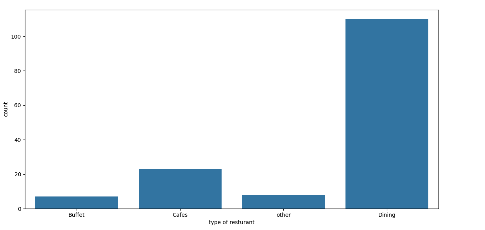
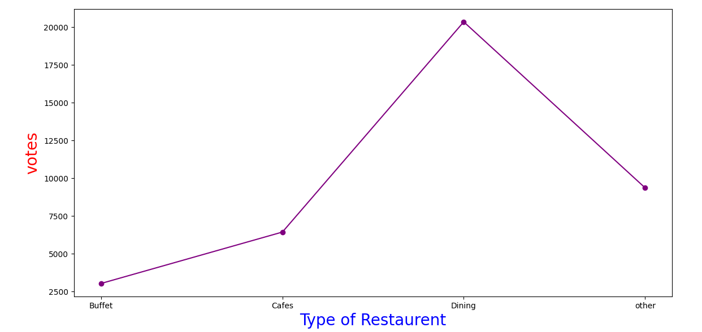
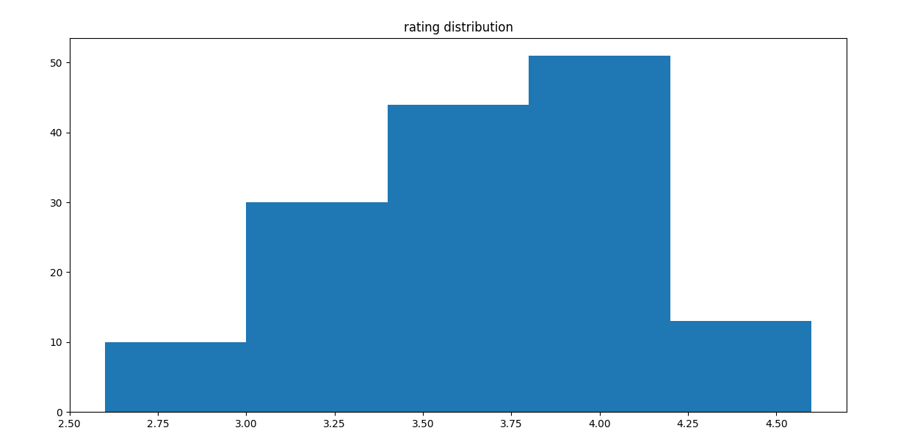
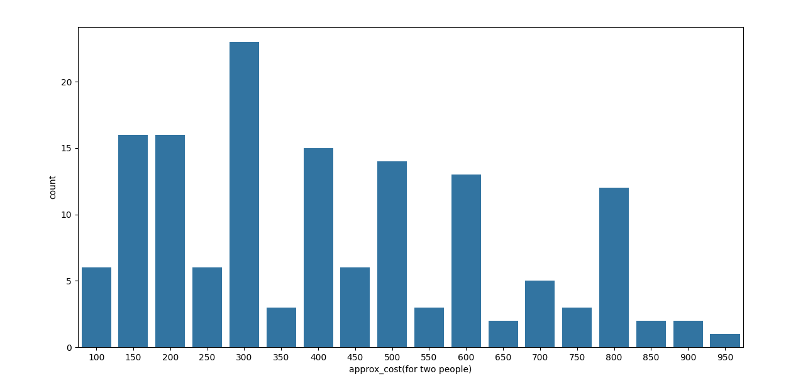
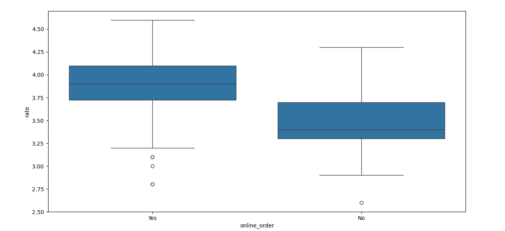
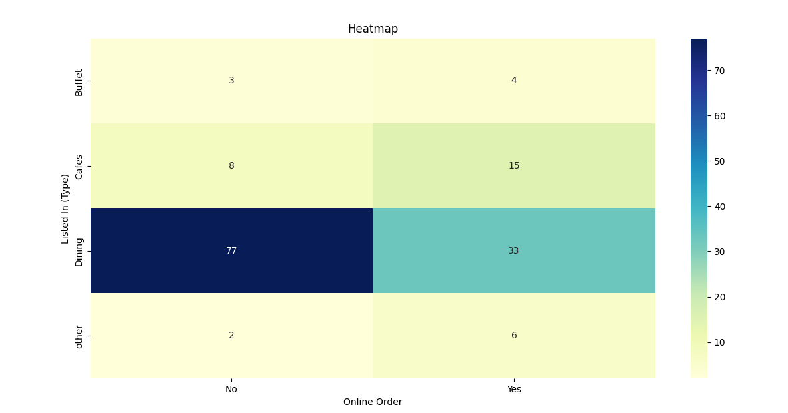

# Data-analysis-of-Zomato


## Overview

This project analyzes a Zomato restaurant dataset to explore various aspects such as restaurant types, customer ratings, voting patterns, approximate costs for two people, and the availability of online ordering. The analysis uses Python libraries including Pandas, NumPy, Matplotlib, and Seaborn to process data and generate visualizations for insights.

## Dataset
The dataset (`Zomato data .csv`) contains information about restaurants listed on Zomato, including:
- Restaurant name
- Rating (out of 5)
- Number of votes
- Approximate cost for two people
- Type of restaurant (e.g., Dining, Cafes)
- Online order availability (Yes/No)
- Other features like location and table booking

## Analysis Objectives
- Investigate the distribution of restaurant types.
- Analyze the relationship between restaurant types and total votes.
- Examine the distribution of customer ratings.
- Explore the cost for two people across restaurants.
- Assess the impact of online ordering on ratings.
- Visualize the correlation between restaurant types and online order availability.

## Code Description
The Python script performs the following steps:
1. **Data Loading and Preprocessing**:
   - Loads the dataset using Pandas.
   - Cleans the `rate` column by extracting the numeric rating (e.g., converts "4.1/5" to 4.1).
   - Displays dataset information and checks for data integrity.

2. **Exploratory Data Analysis (EDA)**:
   - Generates summary statistics and previews the dataset.
   - Processes the `rate` column for numerical analysis.

3. **Visualizations**:
   - **Count Plot**: Displays the distribution of restaurant types.
   - **Line Plot**: Shows the total votes per restaurant type with markers.
   - **Histogram**: Illustrates the distribution of restaurant ratings.
   - **Count Plot**: Visualizes the frequency of approximate costs for two people.
   - **Box Plot**: Compares ratings for restaurants with and without online ordering.
   - **Heatmap**: Shows the count of restaurants by type and online order availability.

## Libraries Used
- **Pandas**: For data manipulation and analysis.
- **NumPy**: For numerical computations.
- **Matplotlib**: For creating static visualizations.
- **Seaborn**: For enhanced statistical visualizations.

## How to Run
1. Ensure Python and required libraries are installed:
   ```bash
   pip install pandas numpy matplotlib seaborn
   ```
2. Place the dataset (`Zomato data .csv`) in the same directory as the script.
3. Run the Python script:
   ```bash
   python analysis.py
   ```
4. Visualizations will be displayed, and console output will show dataset details.

## Results
- Restaurant Type Distribution: A count plot shows the frequency of different restaurant types (e.g., Dining, Cafes).

   <div align="center">
  
</div>

- Votes by Restaurant Type: A line plot illustrates the total votes for each restaurant type, highlighting popularity.
  
   <div align="center">
  
</div>

- Rating Distribution: A histogram displays the spread of ratings, indicating common rating ranges.
  
   <div align="center">
  
</div>

- Approximate Cost for Two: A count plot shows the frequency of different cost brackets for two people.
  
   <div align="center">
  
</div>
- Online Order vs. Rating: A box plot compares ratings for restaurants with and without online ordering.
  
   <div align="center">
  
</div>
- Restaurant Type and Online Order Heatmap: A heatmap shows the count of restaurants by type and online order availability.
   <div align="center">
  
</div>


## Future Improvements
- Handle missing or inconsistent data (e.g., null values or outliers).
- Add statistical analysis to validate trends (e.g., correlation tests).
- Incorporate additional features like location or table booking for deeper insights.
- Use interactive visualizations (e.g., Plotly) for enhanced user experience.

## License
This project is for educational purposes and uses a Zomato dataset. Ensure compliance with any dataset-specific licensing terms.

